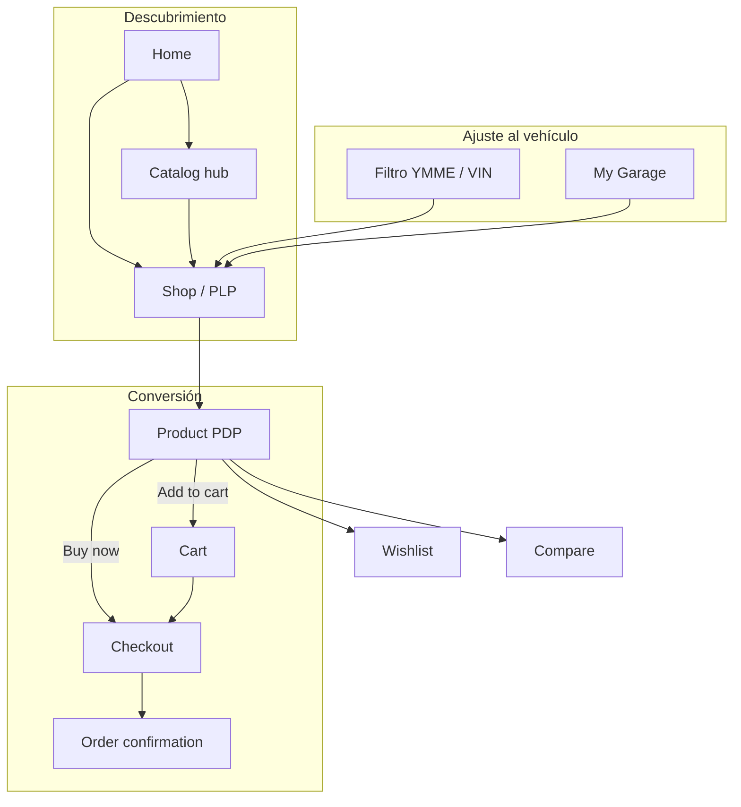

# Autoparts E‑commerce — Especificación de aplicativo y diseño

> **Referencia funcional:** [Mobex Home 6](https://enovathemes.com/mobex/home-6/) (WooCommerce / autopartes)  
> **Objetivo:** Replicar la **misma lógica de negocio y flujos**, con una **UI minimalista, moderna y enfocada en conversión**, sin el ruido visual del demo original.

---

## 1. Visión del producto

Plataforma B2C de **repuestos y accesorios automotrices** donde el usuario:

1. Encuentra piezas por **texto/SKU**, **categoría**, **marca de vehículo** o **compatibilidad YMME/VIN**.
2. Valida que la pieza **sirve para su auto** antes de comprar.
3. Completa la compra en un funnel corto: **catálogo → PDP → carrito → checkout**.

**Propuesta de valor (copiada de Mobex, expresada con menos marketing):**

- Catálogo profundo por sistema del vehículo (frenos, motor, filtros, etc.).
- Ficha técnica con SKU, MPN, EAN y tabla de vehículos compatibles.
- Garaje del usuario, wishlist y comparador.
- Envío, pickup y beneficios de confianza (sin saturar la home).

---

## 2. Principios de diseño (minimalista + moderno)

### 2.1 Filosofía visual

| Mobex (evitar) | Nuestro enfoque |
|----------------|-----------------|
| Header de 3 filas + banner countdown | **Una barra** sticky: logo, búsqueda, acciones |
| Naranja + azul fuerte + muchos badges | **Neutros** + **un acento** (CTA y links activos) |
| Carruseles y banners superpuestos | **Grid limpio**, una promoción hero máxima |
| Mega menú siempre visible | **Navegación por drawer** o sidebar colapsable |
| Tipografía display en mayúsculas | **Sans geométrica**, pesos 400/500/600, títulos sentence case |

### 2.2 Paleta sugerida

```css
/* Tokens de referencia — implementar en CSS variables / Tailwind */
--color-bg:           #FAFAFA;      /* fondo página */
--color-surface:      #FFFFFF;      /* cards, header */
--color-border:       #E5E7EB;      /* divisores sutiles */
--color-text:         #111827;      /* texto principal */
--color-text-muted:   #6B7280;      /* secundario, SKU, hints */
--color-accent:       #0F766E;      /* teal oscuro — confianza, no “taller naranja” */
--color-accent-hover: #0D9488;
--color-danger:       #DC2626;      /* errores, stock agotado */
--color-success:      #059669;      /* stock, confirmaciones */
--radius-sm:          6px;
--radius-md:          10px;
--shadow-sm:          0 1px 2px rgb(0 0 0 / 0.05);
--shadow-md:          0 4px 12px rgb(0 0 0 / 0.06);
```

### 2.3 Tipografía

- **UI:** `Inter`, `Geist` o `DM Sans` — legibilidad en tablas y filtros.
- **Escala:** 12 / 14 / 16 / 20 / 24 / 32 px; line-height 1.5 en cuerpo, 1.2 en títulos.
- **Datos técnicos:** `tabular-nums` para precios y SKU.

### 2.4 Espaciado y layout

- Contenedor máximo: **1280px** (`max-w-7xl`), padding horizontal **16px** móvil / **24px** desktop.
- Ritmo vertical: múltiplos de **8px**.
- Cards de producto: imagen 1:1, padding 16px, sin bordes gruesos — solo `border` 1px o `shadow-sm`.

### 2.5 Componentes base (design system mínimo)

| Componente | Uso |
|------------|-----|
| `Button` | primary (accent), secondary (outline), ghost (iconos) |
| `Input` / `Select` / `Combobox` | búsqueda, filtros YMME, checkout |
| `Badge` | Sale, New, Out of stock — máximo 1 badge por card |
| `Card` | producto, beneficio, blog |
| `Table` | compatibilidad vehículos, carrito desktop |
| `Sheet` / `Drawer` | filtros móvil, mini-cart |
| `Tabs` | PDP: Descripción, Vehículos, Reviews, FAQ |
| `Breadcrumb` | todas las páginas internas |
| `Skeleton` | carga de grid y PDP |
| `Toast` | “Añadido al carrito”, errores |

### 2.6 Accesibilidad y motion

- Contraste WCAG AA en texto y botones.
- Focus ring visible (`ring-2 ring-accent`).
- Animaciones **≤ 200ms**; preferir `opacity` y `transform`, sin autoplay agresivo en hero.
- `prefers-reduced-motion`: desactivar carruseles automáticos.

---

## 3. Arquitectura de información

### 3.1 Mapa de rutas

```
/                           → Home
/catalog                    → Hub: por marca / categoría / fabricante
/shop                       → Listado (PLP)
/shop?make={}&model={}...   → PLP filtrada por vehículo
/product-category/{slug}    → Categoría
/product/{slug}             → Detalle (PDP)
/cart                       → Carrito
/checkout                   → Checkout
/my-account                 → Login / registro
/my-account/orders          → Pedidos
/my-account/wishlist        → Wishlist
/my-account/garage          → Mis vehículos
/my-account/addresses       → Direcciones
/blog                       → Listado artículos
/blog/{slug}                → Post
/faq                        → FAQ
/contact                    → Contacto
/about                      → Nosotros
```

### 3.2 Flujo de compra (lógica Mobex)



### 3.3 Entidades de dominio

| Entidad | Campos clave |
|---------|----------------|
| **Product** | id, slug, name, sku, price, salePrice, images[], brand, condition, mpn, ean, weight, dimensions, categoryIds[], tags[], attributes{}, compatibility[] |
| **Category** | id, slug, name, parentId, image, productCount |
| **Vehicle** | make, model, year, engine, transmission, trim |
| **Compatibility** | productId + vehicle keys |
| **Cart** | lines[{ productId, qty, price }], coupons[], subtotal, shipping, total |
| **Order** | id, status, lines, shippingAddress, paymentMethod, guestEmail |
| **GarageVehicle** | userId, label, ymmet fields, vin? |
| **Wishlist** | userId, productIds[] |
| **CompareList** | sessionId, productIds[] (máx. 4) |

---

## 4. Especificación por pantalla

### 4.1 Layout global

**Header (sticky, 64px)**

```
[Logo]  [ Buscar pieza o SKU ············ 🔍 ]  [Garaje ▾] [♡] [⇄] [Carrito (n)]
```

- **Sin** banner countdown permanente; promos en home o toast dismissible.
- Búsqueda: combobox categoría (opcional) + input; submit → `/shop?q=`.
- Carrito: badge numérico; clic → mini-cart sheet o `/cart`.
- Usuario: avatar → menú (Cuenta, Pedidos, Wishlist, Garaje, Salir).

**Footer (compacto)**

- 3 columnas: Catálogo · Ayuda · Contacto.
- Newsletter una línea: email + botón.
- Legal: términos, privacidad.

**Móvil — barra inferior (5 ítems)**

| Ícono | Acción |
|-------|--------|
| Inicio | `/` |
| Categorías | drawer categorías |
| Vehículo | sheet filtro YMME |
| Buscar | focus en search |
| Cuenta | `/my-account` |

*(Compare puede vivir solo en PDP/header desktop para reducir ruido.)*

---

### 4.2 Home (`/`)

**Objetivo:** Llevar a búsqueda, filtro por vehículo o categoría top — sin 8 carruseles.

| Bloque | Contenido | Diseño |
|--------|-----------|--------|
| Hero | Una frase + CTA “Buscar por vehículo” / “Ver catálogo” | Imagen sobria o ilustración lineal; 60vh máx. |
| Búsqueda rápida | YMME inline (5 selects) + “o por VIN” | Card blanca, sombra suave |
| Categorías top | 8–12 íconos lineales | Grid 4×3 móvil, hover sutil |
| Destacados | 8 productos | Grid 2×4; card minimal |
| Marcas | Logos monocromo | Fila scroll horizontal |
| Confianza | 4 ítems (envío, pickup, garantía, soporte) | Iconos 24px + título + 1 línea |
| Blog | 3 posts recientes | Cards texto-first |
| Newsletter | 1 input | Footer o bloque final |

**No incluir en v1 minimal:** countdown, múltiples heroes, manufacturers doble fila, chat flotante intrusivo.

---

### 4.3 Catalog hub (`/catalog`)

Tres tarjetas grandes:

1. **Por marca de auto** → grid logos → `/shop?make=Audi`
2. **Por categoría de pieza** → árbol resumido → `/product-category/{slug}`
3. **Por marca de repuesto** (Bosch, Ridex…) → `/shop?brand=`

Diseño: cards 1:1 con título, subtítulo y chevron; sin imágenes de stock pesadas.

---

### 4.4 Shop / PLP (`/shop`)

**Lógica Mobex a conservar:**

- Sidebar (desktop) / drawer (móvil): árbol categorías, filtro precio, solo ofertas, marca pieza.
- Toolbar: orden (popularidad, precio ↑↓, novedades, valoración).
- Contador: “Mostrando 1–30 de 160”.
- Tarjeta producto: imagen, nombre, **SKU**, precio, badge sale, wishlist/compare iconos ghost.
- Bloque final: **“¿No encuentras tu pieza?”** → formulario (nombre, móvil, VIN, nº pieza).

**Diseño minimal:**

- Filtros activos como **chips** removibles arriba del grid.
- Card sin descripción larga en listado; “Product information” solo en hover o PDP.
- Paginación numérica simple; opcional “Cargar más” en móvil.

**Query params**

| Param | Ejemplo |
|-------|---------|
| `q` | búsqueda texto/SKU |
| `category` | `brakes` |
| `make` `model` `year`… | filtro vehículo |
| `brand` | `bosch` |
| `on_sale` | `1` |
| `sort` | `price_asc` |
| `page` | `2` |

---

### 4.5 PDP (`/product/{slug}`)

**Layout:** 2 columnas desktop — galería | compra; tabs full-width abajo.

**Columna compra (sticky en scroll)**

- Breadcrumb
- Marca (texto, no logo gigante)
- H1 nombre producto
- SKU · en stock / agotado
- Precio (tachado si sale)
- Cantidad [ − 1 + ]
- **Añadir al carrito** (primary) · **Comprar ahora** (secondary → checkout)
- Enlaces ghost: Wishlist · Comparar
- Tabla compacta: Brand, Condition, MPN, EAN, Weight, Dimensions

**Tabs**

| Tab | Contenido |
|-----|-----------|
| Descripción | HTML/markdown largo |
| Compatibilidad | Tabla buscable Make…Trim |
| Reseñas | Listado + formulario |
| FAQ | Acordeón |

**Relacionados:** fila “También te puede interesar” (4 cards).

**Buy now:** `POST /cart` + redirect `/checkout` (misma sesión que Mobex `?add-to-cart=`).

---

### 4.6 Carrito (`/cart`)

**Estado vacío**

- Ilustración ligera + “Tu carrito está vacío”
- CTA “Explorar catálogo”
- Grid **“Novedades”** o **“En oferta”** (4 productos) — misma lógica Mobex “New in store”

**Estado con ítems**

| Zona | Elementos |
|------|-----------|
| Tabla / lista | Imagen, nombre, SKU, precio unit., qty ±, sublínea, eliminar |
| Resumen | Subtotal, cupón (collapse), envío, **Total** |
| Acciones | “Seguir comprando” · **“Ir al checkout”** (primary full-width móvil) |

**Mini-cart (sheet):** mismas líneas + subtotal + CTA checkout.

---

### 4.7 Checkout (`/checkout`)

**Lógica verificada en Mobex (guest checkout):**

1. **Contacto** — email (obligatorio)
2. **Envío** — país, nombre, dirección, ciudad, estado, ZIP, teléfono opcional
3. **Misma facturación** — checkbox default on
4. **Método envío** — flat rate / gratis
5. **Pago** — transferencia, cheque, contraentrega (según mercado)
6. **Resumen pedido** — sticky derecha: líneas, cupón, total
7. **Place order** · link “Volver al carrito”

**Diseño:** formulario una columna en móvil; pasos visuales opcionales (1-2-3) con línea fina, sin wizard pesado.

---

### 4.8 Cuenta (`/my-account/*`)

| Ruta | Función |
|------|---------|
| `/my-account` | Login / registro email |
| `/my-account/orders` | Lista pedidos + detalle |
| `/my-account/wishlist` | Grid productos guardados |
| `/my-account/garage` | CRUD vehículos (YMME + alias “Mi Golf”) |
| `/my-account/addresses` | Direcciones guardadas |
| `/my-account/profile` | Datos personales |

**My Garage — lógica clave:** al seleccionar vehículo activo, filtrar PLP/PDP por compatibilidad y mostrar banner “Mostrando piezas para: Audi A4 2018…”.

---

### 4.9 Wishlist y Compare

- **Wishlist:** persistida con usuario; icono corazón toggle en PLP/PDP.
- **Compare:** máximo **4** productos; tabla atributos en `/compare` o sheet; icono ⇄ en header.

---

### 4.10 Contenido y soporte

- **Blog:** grid cards, tipografía legible, sin sidebar pesado.
- **FAQ:** acordeón por sección (compras, envíos, devoluciones, producto).
- **Contacto:** formulario contextual (con/sin pedido), teléfono, chat opcional.

---

## 5. Modelo de datos — compatibilidad vehículo

### 5.1 Filtro YMME (cascada)

```
Make (habilita) → Model → Year → Engine → Transmission → Trim
```

- Cada paso carga opciones vía API según selección anterior.
- Botón **“Aplicar”** → redirige a `/shop` con query params.
- **Reset** limpia sesión filtro.
- Alternativa: **VIN** → decode API → prellenar YMME.

### 5.2 Tabla en PDP

Columnas: Make | Model | Year | Engine | Transmission | Trim  
- Buscador client-side o server-side sobre la tabla.
- Paginación si > 50 filas.

---

## 6. API y estado (referencia implementación)

### 6.1 Endpoints sugeridos (REST o tRPC)

```
GET  /api/products              ?q &category &make &sort &page
GET  /api/products/:slug
GET  /api/categories
GET  /api/vehicles/makes
GET  /api/vehicles/models?make=
GET  /api/vehicles/...          (cascade)
POST /api/vehicles/decode-vin
GET  /api/cart
POST /api/cart/items
PATCH /api/cart/items/:id
DELETE /api/cart/items/:id
POST /api/cart/coupon
POST /api/checkout
GET  /api/orders
GET  /api/wishlist
POST /api/wishlist/:productId
GET  /api/garage
POST /api/garage
```

### 6.2 Estado cliente

| Store | Contenido |
|-------|-----------|
| `cart` | líneas, loading, sync con cookie/session |
| `vehicleFilter` | ymmet seleccionado |
| `garage` | vehículos usuario + activo |
| `compare` | ids[] máx 4 |
| `ui` | drawers, mini-cart open |

---

## 7. Stack técnico recomendado

| Capa | Opción |
|------|--------|
| Framework | **Next.js 15** (App Router) |
| Estilos | **Tailwind CSS 4** + CSS variables |
| Componentes | **shadcn/ui** (encaja con minimal) |
| Forms | React Hook Form + Zod |
| Data | Prisma + PostgreSQL (o Supabase) |
| Auth | NextAuth / Clerk |
| Búsqueda | Meilisearch o Algolia (SKU + nombre) |
| Pagos | Stripe / Mercado Pago (según país) |
| Imágenes | `next/image` + CDN |

---

## 8. Matriz de prioridades (MVP → v2)

### MVP (paridad lógica Mobex esencial)

- [ ] Home + PLP + PDP con YMME en header
- [ ] Carrito + checkout guest
- [ ] SKU, MPN, EAN, tabla compatibilidad
- [ ] Categorías jerárquicas
- [ ] Wishlist (usuario logueado)
- [ ] Responsive + mini-cart

### v1.1

- [ ] My Garage
- [ ] Compare (4 productos)
- [ ] Cupones
- [ ] Blog + FAQ

### v2

- [ ] VIN decode
- [ ] Búsqueda facetada avanzada
- [ ] Pickup en tienda / localizador
- [ ] Reviews verificadas
- [ ] Programa loyalty

---

## 9. Diferencias visuales resumidas (Mobex → nuestro)

| Aspecto | Mobex | Autoparts (minimal) |
|---------|-------|---------------------|
| Header | 3 niveles + promo | 1 barra limpia |
| Color | Azul + naranja | Neutro + teal/accent único |
| Hero | Slider 3+ slides | 1 mensaje + CTA |
| Categorías | Carrusel iconos 3D | Grid flat icons |
| PLP card | Mucha metadata visible | Nombre, SKU, precio, 1 badge |
| PDP | Tabs + bloques densos | Sticky buy box + tabs aireados |
| Confianza | 6 columnas iconos | 4 ítems línea única |
| Footer | Muy largo | Compacto 3 columnas |
| Chat | Botón flotante | Link en header/footer |

---

## 10. Criterios de aceptación (por flujo)

### Compra guest

1. Usuario añade producto desde PDP → badge carrito = 1.
2. `/cart` muestra línea correcta con qty editable.
3. “Ir al checkout” → formulario email + envío + resumen con total.
4. “Place order” crea pedido y muestra confirmación.

### Filtro vehículo

1. Seleccionar Make…Trim y aplicar → PLP solo compatible (o marcado “compatible con tu vehículo”).
2. Reset elimina filtros.

### Garaje (v1.1)

1. Guardar vehículo en garage.
2. Activar vehículo persiste en sesión y filtra catálogo.

---

## 11. Referencias

- Demo funcional: [Mobex Home 6](https://enovathemes.com/mobex/home-6/)
- Shop: [enovathemes.com/mobex/shop/](https://enovathemes.com/mobex/shop/)
- Carrito: [enovathemes.com/mobex/cart/](https://enovathemes.com/mobex/cart/)
- Checkout: [enovathemes.com/mobex/checkout/](https://enovathemes.com/mobex/checkout/)

---

## 12. Próximos pasos sugeridos

1. Validar nombre de marca, mercado (CO/US) y métodos de pago.
2. Crear `packages/ui` con tokens §2.2 y componentes §2.5.
3. Implementar rutas §3.1 en Next.js con layouts compartidos.
4. Poblar seed de categorías alineadas al árbol Mobex (19 categorías raíz).
5. Wireframes en Figma opcionales a partir de este documento.

---

*Documento generado como blueprint de producto y diseño. Versión 1.0.*
